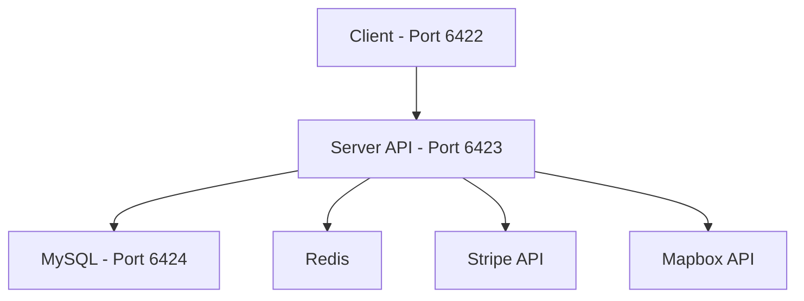

# 🥬 OFS (On-Demand Food Service) Application

> A full-stack e-commerce platform for a local organic food retailer chain in the San Jose Downtown area, featuring online shopping, automated delivery optimization, and inventory management.

[](https://www.docker.com/)
[](https://nodejs.org/)
[](https://reactjs.org/)
[](https://www.mysql.com/)

---

## 📚 Table of Contents

- [📋 Overview](#-overview)
- [✨ Key Features](#-key-features)
  - [🛒 Customer Features](#-customer-features)
  - [🔒 Security Features](#-security-features)
  - [🚚 Delivery System](#-delivery-system)
  - [📊 Management Features](#-management-features)
- [🛠 Tech Stack](#-tech-stack)
- [🏗 Architecture Overview](#-architecture-overview)
- [🚀 Quick Start](#-quick-start)
  - [Prerequisites](#prerequisites)
  - [Installation](#installation)
- [🔐 Environment Setup](#-environment-setup)
- [🗄 Database Access](#-database-access)
- [📁 Docker Compose](#-docker-compose)
- [💻 Development](#-development)
  - [Building from Source](#building-from-source)
  - [Viewing Logs](#viewing-logs)
  - [Stopping Services](#stopping-services)
- [🔍 Health Checks](#-health-checks)
- [📞 Support](#-support)

---

## 📋 Overview

OFS is a modern web application that enables customers to purchase organic foods online and have them delivered by simulated autonomous vehicles. The system includes inventory management, order processing, delivery optimization, and a comprehensive dashboard for store employees and managers.

## ✨ Key Features

### 🛒 Customer Features
- Browse and purchase organic foods (fruits, vegetables, groceries)
- Virtual shopping cart with item weight tracking
- Online payment processing with Stripe
- Automatic delivery fee calculation
  - ✅ Free delivery for orders under 20 lbs
  - ⚠️ $10 delivery fee for orders 20+ lbs
- Order tracking and simulated delivery

### 🔒 Security Features

**Authentication & Session Management**
- Secure user authentication with JWT cookies
- JWT blacklisting on logout using Redis
- HTTP-only cookies for sensitive data

**Request Protection**
- CSRF token protection for all API endpoints
- Rate limiting
- Strict CORS policy with credentials

**Data Security**
- Input validation and sanitization using Express Validator
- Secure password hashing

### 🚚 Delivery System
- Bull queue for delivery job processing
- **Capacity**: 10 orders per robot trip (up to 200 lbs total)
- Automated route optimization using Mapbox API

### 📊 Management Features
- Admin inventory management dashboard
  - CRUD operations on products

## 🛠 Tech Stack

| Category | Technologies |
|----------|-------------|
| **Frontend** |     |
| **Backend** |   |
| **Database** |   |
| **Services** |   |
| **Queue** |  |
| **DevOps** |   |

## 🏗 Architecture Overview



The application consists of four main services orchestrated with Docker Compose:

| Service | Description | Port |
|---------|-------------|------|
| **MySQL** | Primary relational data storage | `6424` |
| **Redis** | JWT blacklisting & Bull queue management | Default |
| **Server** | Node.js/Express API backend | `6423` |
| **Client** | React frontend served by Nginx | `6422` |

## 🚀 Quick Start

### Prerequisites

- Docker Desktop installed ([Download here](https://www.docker.com/products/docker-desktop/))
- Stripe CLI installed ([Download here](https://docs.stripe.com/stripe-cli/))
- Log in to stripe with test account credentials. To obtain the stripe test account credentials, please contact:
  - 📧 Email: michael.stephen.huh@gmail.com
  - 💬 Discord: mikrelin
- Environment variables configured (see Environment Setup)

### Installation

1. **Clone the repository**
   ```bash
   git clone git@github.com:mikeshuh/OFS.git
   ```
   or alternatively, just copy the docker-compose.yml file into a folder on your file system

2. **Set up environment variables**
   - Create `.env` file in root directory (where the docker-compose.yml file is)
   - Contact for credentials (see below)

3. **Build and start containers**
   ```bash
   docker-compose up -d
   ```
   
4. **Run Stripe CLI**
   ```bash
   stripe login
   ```
   Make sure you log in on the OFS account in Test mode.
   
   

   ```bash
   stripe listen --forward-to localhost:6423/api/payments/webhook
   ```
   Make sure the webhook signing secret that displays in terminal matches the one we provide for your `.env`.

6. **Access the application**
   - 🌐 Frontend: http://localhost:6422
   - 🔌 API: http://localhost:6423
   - 🗄️ MySQL: localhost:6424

## 🔐 Environment Setup

To obtain the necessary environment variables, please contact:

📧 **Email**: michael.stephen.huh@gmail.com  
💬 **Discord**: `mikrelin`

The environment file includes:
- Database credentials
- API keys (Stripe, Mapbox)
- JWT secrets
- Redis connection details
- Other application-specific settings

## 🗄 Database Access

To connect to the MySQL database directly:

```bash
# Connect to MySQL from your local machine
mysql -P 6424 -u root -p
```

When prompted for a password, enter the `MYSQL_ROOT_PASSWORD` value from your `.env` file.

This gives you direct access to manage the database, run queries, and inspect data.

## 📁 Docker Compose
```yaml
services:
  mysql:
    image: mikeshuh/ofs-mysql:latest
    build:
      context: ./database
      dockerfile: Dockerfile
    env_file: .env
    volumes:
      - db_data:/var/lib/mysql
    ports:
      - "6424:3306"  # Maps host port 6424 to container port 3306
    restart: unless-stopped
    healthcheck:
      test: ["CMD", "mysqladmin", "ping", "-h", "localhost", "-u", "root", "-p$${MYSQL_ROOT_PASSWORD}"]
      interval: 5s
      timeout: 5s
      retries: 10
      start_period: 30s

  redis:
    image: redis:7-alpine
    restart: unless-stopped
    command: ["redis-server","--appendonly","yes"]
    volumes:
      - redis_data:/data
    healthcheck:
      test: ["CMD", "redis-cli", "ping"]
      interval: 5s
      timeout: 5s
      retries: 3

  server:
    image: mikeshuh/ofs-server:latest
    build:
      context: ./server
      dockerfile: Dockerfile
    env_file: .env
    ports:
      - "6423:4000"
    depends_on:
      mysql:
        condition: service_healthy
      redis:
        condition: service_healthy
    restart: unless-stopped
    healthcheck:
      test: ["CMD-SHELL","curl -f http://localhost:4000/health || exit 1"]
      interval: 30s
      timeout: 5s
      retries: 3

  client:
    image: mikeshuh/ofs-client:latest
    build:
      context: ./client
      dockerfile: Dockerfile
    ports:
      - "6422:80"
    depends_on:
      - server
    restart: unless-stopped
volumes:
  db_data:
  redis_data:
```
Ensure the host ports (6422, 6423, 6424) are not already in use.

## 💻 Development

### Building from Source
```bash
# Build all services
docker-compose build

# Build specific service
docker-compose build mysql
docker-compose build server
docker-compose build client
```

### Viewing Logs
```bash
# All services
docker-compose logs -f

# Specific service
docker-compose logs -f server
```

### Stopping Services
```bash
# Stop all services
docker-compose down

# Stop and remove volumes (⚠️ deletes data)
docker-compose down -v
```

## 🔍 Health Checks

| Service | Check Method | Interval |
|---------|-------------|----------|
| MySQL | `mysqladmin ping` | 5s |
| Redis | `redis-cli ping` | 5s |
| Server | `http://localhost:6423/health` | 30s |

### 📞 Support

For assistance or to report issues:
- 📧 Email: michael.stephen.huh@gmail.com
- 💬 Discord: mikrelin

---

<div align="center">
  <strong>Need Environment Variables?</strong>
  <br>
  Contact Michael at <a href="mailto:michael.stephen.huh@gmail.com">michael.stephen.huh@gmail.com</a> or on Discord (mikrelin)
</div>
